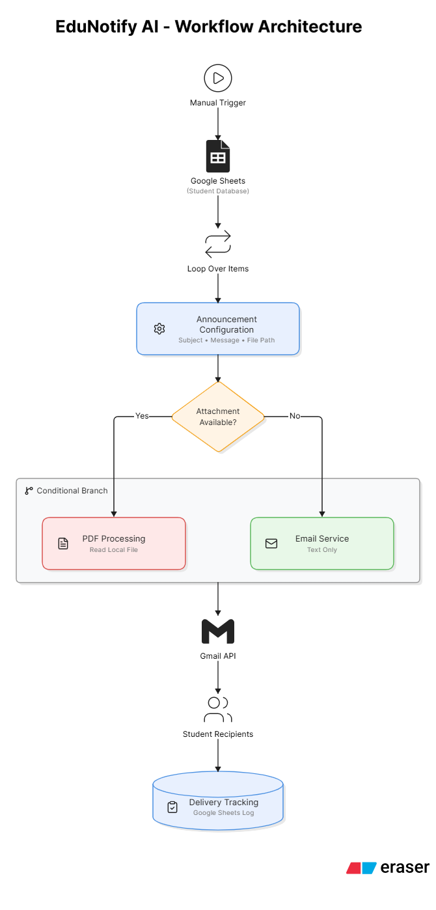

# 📧 EduNotify AI: Intelligent Student Communication and Email Automation System

## Overview

EduNotify AI is an intelligent workflow automation system built using **n8n**, **Google Sheets**, and the **Gmail API** to streamline academic communication. The platform automates personalized email notifications for large student groups, reducing repetitive manual effort while ensuring privacy, consistency, and reliable communication.

The workflow dynamically evaluates notification requirements, supports optional PDF attachments, and maintains delivery logs for tracking and auditing purposes.

---

## 🎯 Problem Statement

Academic announcements, internship updates, examination schedules, and departmental circulars are often distributed manually, making the process time-consuming, repetitive, and difficult to track.

EduNotify AI addresses this challenge by automating the communication process through a centralized and scalable workflow automation system.

---

## 💡 Solution

EduNotify AI automates the complete notification lifecycle by:

* Retrieving student records from Google Sheets.
* Processing recipients individually to preserve privacy.
* Generating personalized email notifications.
* Dynamically handling optional PDF attachments.
* Sending emails through Gmail API integration.
* Recording delivery status and timestamps for monitoring.

---

## 🚀 Key Features

* Personalized email communication
* Automated bulk notification delivery
* Conditional PDF attachment handling
* HTML email template support
* Google Sheets integration
* Gmail API integration
* OAuth 2.0 authentication
* Delivery status tracking
* Local file management for attachments
* Privacy-preserving individual email distribution

---

## 🏗️ Workflow Architecture

<p align="center">
  
</p>

---

## 🛠️ Technology Stack

| Category            | Technology           |
| ------------------- | -------------------- |
| Workflow Automation | n8n                  |
| Data Source         | Google Sheets        |
| Email Service       | Gmail API            |
| Authentication      | OAuth 2.0            |
| Templates           | HTML Email Templates |
| File Handling       | Local File System    |

---

## 📌 Use Cases

* Internship Notifications
* Academic Calendar Distribution
* Examination Schedules
* Workshop Announcements
* Placement Drive Notifications
* Assignment & Project Updates
* Department Circulars

---

## 📊 Project Highlights

* Automated communication for large student groups.
* Supports both text-only and attachment-based notifications.
* Maintains delivery logs for auditing and tracking.
* Reduces manual communication effort significantly.
* Designed using modular and reusable workflow architecture.

---

## ⚙️ Configuration Required

Before running the workflow:

1. Configure Google Sheets OAuth credentials.
2. Configure Gmail OAuth credentials.
3. Replace `YOUR_GOOGLE_SHEET_ID` with your spreadsheet ID.
4. Update the email subject and HTML template.
5. Optionally provide a local file path for attachments.

---

## 📂 Repository Structure

```text
EduNotify-AI/
│
├── README.md
├── workflow/
│   └── edunotify-workflow.json
│
├── assets/
│   ├── architecture-diagram.png
│   ├── workflow-screenshot.png
│   └── sample-email.png
```

---

## 🔮 Future Enhancements

* AI-powered email drafting using LLMs
* Automated announcement summarization
* Google Forms integration
* Scheduled notifications
* WhatsApp and Telegram integration
* Advanced delivery analytics and reporting

---

## ✅ Outcome

EduNotify AI demonstrates how workflow automation can transform academic communication by reducing manual effort, improving reliability, supporting document distribution, and enabling scalable notification management for large student groups.
